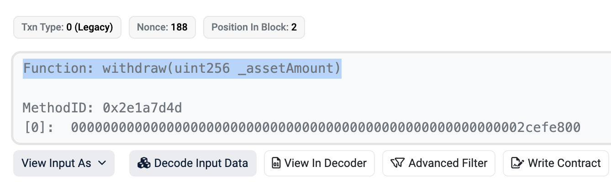
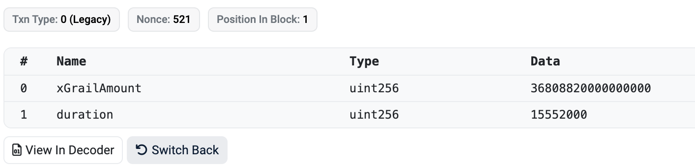
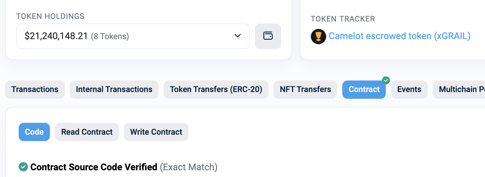
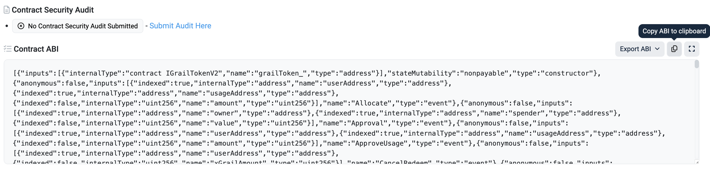

## Getting Started

First, `cp .env.sample .env.local` and update the values if needed.

Then:

1. `yarn`
2. `doppler run -- yarn dev`

Open [http://localhost:3000](http://localhost:3000) with your browser to see the result.

You can start editing the page by modifying `pages/index.tsx`. The page auto-updates as you edit the file.

## Some Routines

1. How do we update Chains/Protocols/Tokens's Pictures? Refer to [public/README.md](public/README.md) please

## Vitest

1. Configuring Vitest: `Vitest` will read your root `vite.config.js` to match with the plugins and setup as your app.
2. Add Vitest Unit Test: Create `__tests__` folder in root. Create `basepage.test.jsx` for example.
3. Running your tests: run `yarn test`.

### Vitest Coverage

1. install @vitest/coverage-v8 `yarn add @vitest/coverage-v8 --dev`
2. Showing your Vitest Coverage : run `yarn coverage`.

### Vitest UI

1. Start the tests with UI: run `yarn test-ui`.
2. Then you can visit the Vitest UI at [http://localhost:51204/**vitest**/](http://localhost:51204/__vitest__/).

## CI/CD

1. [./github/workflows/lint.yaml]: before committing to Github, run `yarn format`. Otherwise, `prettier` would raise an exception
2. [./github/workflows/vitest.yaml]: before committing to Github, run `yarn test`.
3. Fleek: Click this link
   
4. Deployment:
   1. staging(branch `main`): <https://all-weather-protocol-staging.on.fleek.co/>
   2. prod(prod `prod`): <https://all-weather-protocol.on.fleek.co/>

## TO-DO

need a linter like this one <https://github.com/david30907d/all-weather-scaffold/actions/runs/5637981937/job/15271636819>

## For Devs

### How to Integrate New Protocols

1. Get the Txns for the New Protocol:
   1. Interact with the protocol using your wallet in your browser. For instance, if you want to integrate a staking pool into All Weather, first stake $1 in it with your EOA wallet.
   2. Then check your transaction on the explorer to get the method name and parameters we need (e.g., [txn](https://arbiscan.io/tx/0x89732a3f4d946ba1a29b78aabac6114bb62aba236cd77eacbd7417d8c49fb15e))
      1. function name 
      2. params 
      3. contract address 
      4. contract code 
      5. ABI 
   3. Save those ABI json files to this [folder](https://github.com/all-weather-protocol/all-weather-frontend/tree/main/lib/contracts) by protocol
2. Development - Implement Transactions from Step 1 in JS:
   1. Inherit from [BaseProtocol.js](./classes/BaseProtocol.js)
   2. Add your new protocol class to an existing vault (like [EthVault](./classes/Vaults/EthVault.jsx)) or create a new one
      - Tip: While developing, comment out other protocols in the vault to speed up bundled transactions
   3. Integrate into the Vault: [./utils/thirdwebSmartWallet.ts](./utils/thirdwebSmartWallet.ts)
   4. Add your new vault to the [landing page](./pages/indexes/index.jsx)
   5. Test on the frontend-side
3. Testing:
   1. Create a test vault containing only your protocol, similar to [this example](https://github.com/all-weather-protocol/all-weather-frontend/blob/main/utils/thirdwebSmartWallet.ts#L17-L22)
   2. Copy existing test cases from [./**tests**/intent](./__tests__/intent/) and modify them for your protocol
4. Update Transaction Parser in Rebalance Backend: `_find_refund_data_by_txn_hash()`
5. Tips:
   1. comment the `loading={zapInIsLoading}` in ZapInTab.jsx for testing
   2. comment the `depositTxn`, `stakeTxn` etc in the new protocol class for testing

### How to Integrate New Chain

<https://portal.thirdweb.com/connect#supported-chains>

1. Need to check if bridge supports the new chain
2. Update UI of course
3. Update CHAIN_ID_TO_CHAIN, etc... in general.js
4. Need to update the gas sponsorship settings on ThirdWeb
5. check these funcs in indexOverviews.jsx:
   * `switchNextChain`
   * `const [chainStatus, setChainStatus]`
   * `chainMap`