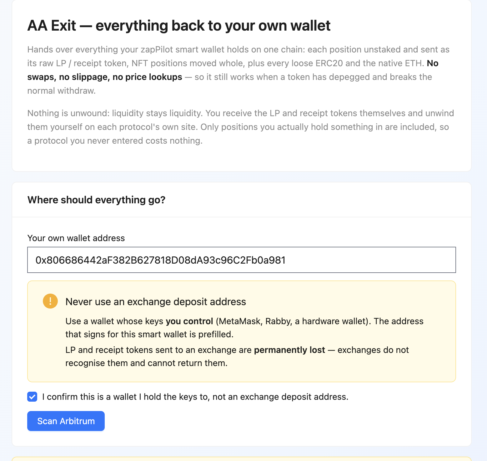
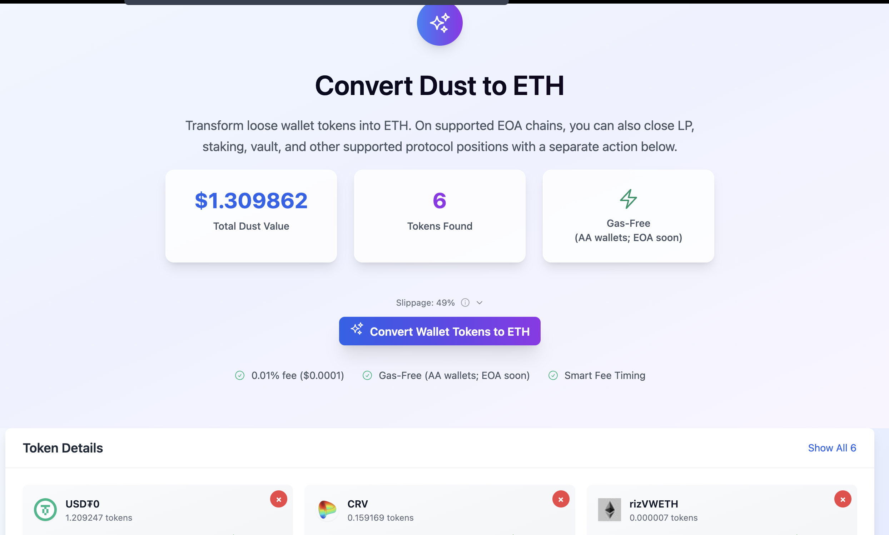
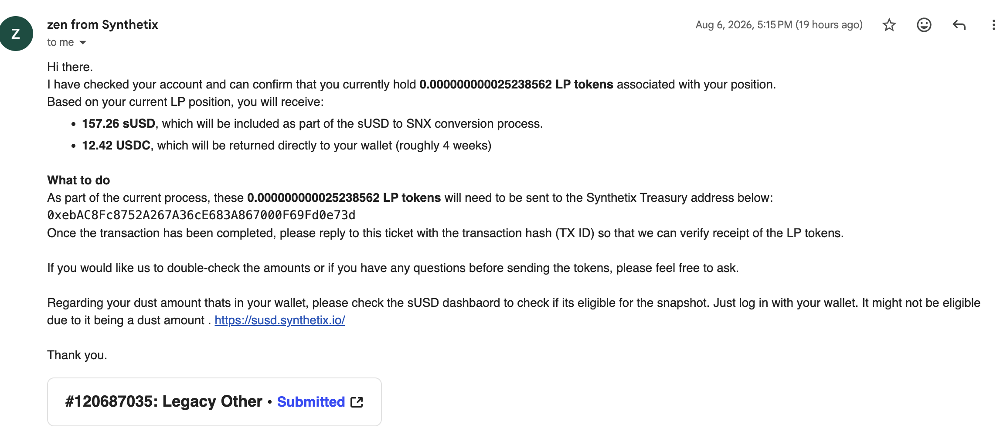

# Zap Pilot 舊策略全面清退資產指南

親愛的用戶您好，

Zap Pilot 決定對過去舊策略中的 **ALP、Synthetix / sUSD、Metronome msUSD 等 DeFi 部位進行全面清退**。請不要再對這批舊策略加碼，並依照本指南把資產從 **AA Wallet 完整退出到自己的 EOA Wallet**，再視需要將剩餘 DeFi 部位與代幣統一轉成 ETH。

> ⚠️ **重要：請依序完成「AA Exit → EOA 確認收款 → DustZap」**
>
> 不要只處理目前所在的單一鏈。請逐一檢查你過去使用過的鏈，確認 AA Wallet 中可退出的資產都已經回到你自己的 EOA Wallet。

---

## 為什麼要全面清退？

這次不是只處理單一 sUSD/USDC LP，而是要停止整批舊策略並降低後續風險與維護複雜度。

過去配置的底層協議近年陸續出現以下風險變化：

- 部分舊產品、舊部署或策略已進入 **deprecation / wind-down** 階段；
- **sUSD 曾長時間偏離 1 USD**，而 Synthetix 的 Optimism 舊產品也已進入退場流程；
- 部分底層協議與報價機制曾發生 **預言機／報價異常、套利與資產損失** 等事件；
- ALP、sUSD、msUSD 等舊部位的退出路徑與流動性條件，已不再適合作為 Zap Pilot 的長期預設配置。

因此我們現在的目標很簡單：**先把資產控制權完整收回到你自己的 EOA Wallet，再把不需要繼續持有的 DeFi 部位簡化成 ETH。**

---

# 第一步：用 AA Exit 把所有鏈的資產退出到 EOA Wallet

請前往：

**https://app.zap-pilot.org/aa-exit/**

操作畫面：

請依照以下順序操作：

1. 連接你原本使用 Zap Pilot 的錢包。
2. 確認頁面顯示的 **Destination / Recipient 是你自己的 EOA Wallet**。
3. 逐一切換並檢查你過去使用過的鏈。
4. 在每一條鏈執行 Exit，把可退出的 token、LP、staking、vault 等部位退出並轉回 EOA。
5. 等交易確認後，**實際檢查 EOA Wallet 是否收到資產**，再處理下一條鏈。

> **不要因為某一條鏈已經顯示完成，就假設其他鏈也已經清空。**

如果 AA Exit 顯示某個部位無法自動處理、交易失敗或仍有殘留餘額，請先保留該筆資產，不要自行 burn、亂轉合約或重複操作高風險交易；記下 **錢包地址、鏈、協議／池名與 transaction hash** 後聯絡 Zap Pilot，我們會協助確認特殊退出方式。

---

# 第二步：用 DustZap 把 EOA 裡的 DeFi 資產與零散代幣轉成 ETH

確認 AA Wallet 的資產已經回到 EOA Wallet 後，請前往：

**https://app.zap-pilot.org/dustzap/**

DustZap 現在提供兩種主要操作：

- **Convert Wallet Tokens to ETH**：把 EOA Wallet 中支援的零散 token 統一換成 ETH。
- **Close Protocol Positions to ETH**：把支援的 LP、staking、vault 與其他 DeFi 部位退出後轉成 ETH。

請在**每一條仍有資產的鏈**分別檢查並執行。送出交易前，請再次確認頁面顯示的資產、預估收到數量、slippage、price impact 與 gas 等資訊。

> DustZap 會盡可能把支援的資產簡化成 ETH，但鏈上交易仍可能受到流動性、滑價、gas、協議狀態或路由可用性影響。**不要把「一鍵」理解成保證固定價格或完全無損。**

---

# 第三步：清退完成後，你可以怎麼處理 ETH？

完成後，資產應盡可能回到你自己控制的 EOA Wallet，並簡化為 ETH。接下來可依自己的需求選擇：

### 1. 轉到交易所

如果你希望轉回法幣、穩定幣或使用交易所保管，可以把 ETH 轉到你自己的交易所帳戶。

**請務必確認交易所支援你目前 ETH 所在的鏈，並先用小額測試。** 不同鏈的 ETH 不一定能直接存入同一個充值地址。

### 2. 繼續持有 ETH

如果暫時不想進入新的 DeFi 策略，可以單純把 ETH 留在自己的 EOA Wallet。這能減少額外的協議、預言機與 LP 結構風險，但仍然承受 ETH 本身的價格波動與錢包私鑰風險。

### 3. 自行評估 Lido 等較單純的 ETH staking

如果你仍希望取得 ETH staking 收益，可以自行評估 Lido 等成熟 staking 協議，作為比多層 DeFi 策略更單純的鏈上配置。

但 staking **不是保本**：仍有 smart contract、slashing、流動性／脫錨以及鏈與橋接等風險。請只透過官方入口操作，並確認你所在的鏈與產品是否受到官方支援。

---

# 第四步：sUSD / Synthetix 特殊部位請聯絡客服

如果您在 **Velodrome** 中存放了 **sUSD/USDC LP**，或仍有其他無法自動退出的 Synthetix / sUSD 部位：因為這些智能合約用了一種特殊方式把代幣 **Burn 掉**，導致資金卡在合約裡，**無法自動領回**。

> ⚠️ **重要提醒：這是人工處理流程**
> 這類 LP 部位的資金**不會自動退回**，必須**聯繫客服**，由客服確認金額後退款，每一個案件都會個別處理，請耐心等待。

請到 Synthetix 官方文件網站：**https://docs.synthetix.io/**

開啟客服視窗的方法如下圖（**右下角**就是客服按鈕）：

點進去後，**開一張客服工單（Support Ticket）**，並向客服表示要申請找回您 Velodrome 中的 sUSD/USDC LP 資金。

工單中請一併附上以下資訊：

- **您的錢包地址**
- **使用的區塊鏈網路**
- **您存放的 LP 協議名稱（Velodrome）**
- **池名（sUSD/USDC 流動池）**
- （如果有的話）相關的交易雜湊（Transaction hash）

客服會審查您的持倉，**確認退款金額**後，就會把款項退回給您。請參考下圖說明：

請在工單中和客服**確認清楚您要拿回的金額**，客服審查確認後，就會把錢退給您。

---

## 清退完成檢查表

- [ ] 我已在 AA Exit 檢查所有曾使用過的鏈。
- [ ] AA Wallet 中可退出的 token 與 DeFi positions 已退出到自己的 EOA。
- [ ] 我已確認 EOA Wallet 實際收到資產。
- [ ] 我已在 DustZap 檢查並處理每一條仍有資產的鏈。
- [ ] 不需要繼續持有的零散 token 已轉成 ETH。
- [ ] 支援的一般 DeFi positions 已 close / withdraw 並轉成 ETH。
- [ ] 若仍有無法自動退出的特殊部位，我已保留資訊並聯絡 Zap Pilot，而不是自行進行不可逆操作。

---

## 背景參考

Synthetix 已公告 Optimism 舊產品與 Synths 的 deprecation / migration 安排；sUSD 也曾長期脫離 1 USD。這也是我們不再讓用戶繼續停留在舊策略、而改採全面清退的原因之一。

- Synthetix — Mainnet is Where the Heart is: https://blog.synthetix.io/mainnet-is-where-the-heart-is/
- Synthetix — Deprecation of Synths on Optimism: https://blog.synthetix.io/deprecation-of-synths-on-optimism/
- Synthetix — Rebuilding sUSD: https://blog.synthetix.io/rebuilding-susd/

---

如果你在清退途中看到 **Excluded、Failed、Route unavailable、Simulation failed** 或仍有資產沒有退出，請不要反覆送出不確定的交易。把畫面、錢包地址、鏈與 transaction hash 提供給 Zap Pilot，我們會協助你確認下一步。

**本指南的優先目標是：把舊策略完整退場，讓資產重新回到用戶自己控制的錢包。**
